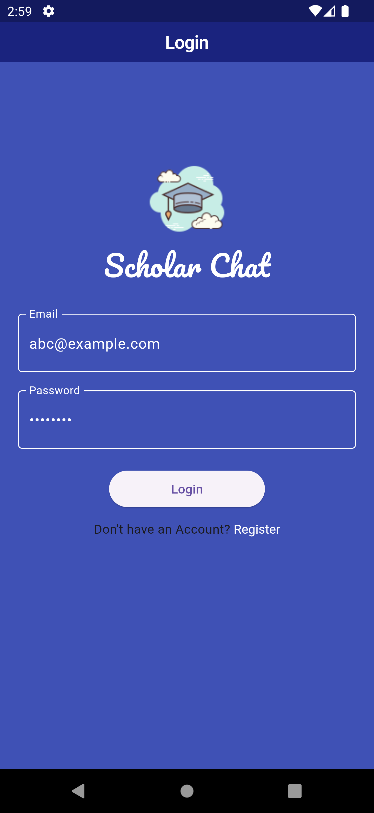
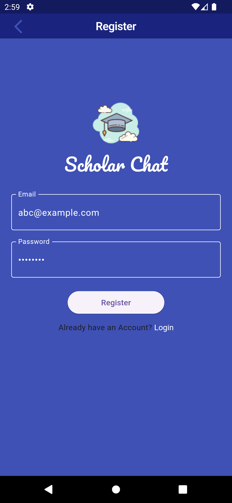
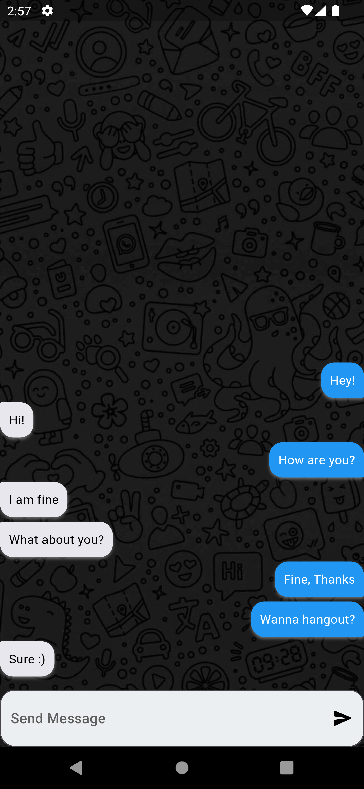
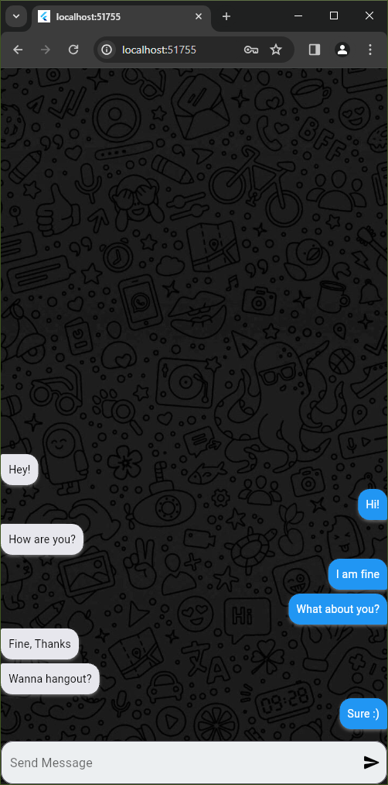

# ChatApp

[](https://flutter.dev/)

ChatApp is a Flutter-based chat application with authentication and real-time messaging functionality. The app uses Firebase Auth for authentication and Firebase Firestore for storing chat messages. It employs Cubit for state management and Flutter Chat Bubble for chat message UI.

## Features

- **Login Screen**: 
  - Users can log in with their email and password.
  - Handles errors such as "email does not exist" or "password does not match".
  
- **Register Screen**: 
  - Users can register with their email and password.
  - Handles errors such as "email already in use" or "weak password".

- **Chat Screen**: 
  - Displays chat messages using Flutter Chat Bubble.
  - Allows sending and receiving real-time messages.

## Packages Used

- [bloc: ^8.1.4](https://pub.dev/packages/bloc)
- [chat_bubbles: ^1.6.0](https://pub.dev/packages/chat_bubbles)
- [cloud_firestore: ^4.15.8](https://pub.dev/packages/cloud_firestore)
- [cupertino_icons: ^1.0.2](https://pub.dev/packages/cupertino_icons)
- [firebase_auth: ^4.17.8](https://pub.dev/packages/firebase_auth)
- [firebase_core: ^2.27.0](https://pub.dev/packages/firebase_core)
- [flutter: sdk: flutter](https://flutter.dev/)
- [flutter_bloc: ^8.1.5](https://pub.dev/packages/flutter_bloc)
- [flutter_chat_bubble: ^2.0.2](https://pub.dev/packages/flutter_chat_bubble)
- [flutter_chat_ui: ^1.6.12](https://pub.dev/packages/flutter_chat_ui)
- [meta: ^1.10.0](https://pub.dev/packages/meta)
- [modal_progress_hud_nsn: ^0.5.1](https://pub.dev/packages/modal_progress_hud_nsn)

## Screenshots

<div style="display: flex; flex-wrap: wrap;">
    <div style="margin: 10px;">
        <p>Login Screen</p>
        
    </div>
    <div style="margin: 10px;">
        <p>Register Screen</p>
        
    </div>
    <div style="margin: 10px;">
        <p>Chat Screen</p>
        
        
    </div>
</div>

## Getting Started

Follow these instructions to get a copy of the project running on your local machine.

### Prerequisites

- Flutter SDK: [Install Flutter](https://flutter.dev/docs/get-started/install)
- Firebase Project: Set up a Firebase project and add the necessary configuration files to your Flutter project.

### Installation

1. Clone the repository:
   ```bash
   git clone https://github.com/marcolous/Flutter-ChatApp.git
   ```
2. Navigate to the project directory:
   ```bash
   cd ChatApp
   ```
3. Install the dependencies:
   ```bash
   flutter pub get
   ```
4. Set up Firebase configuration:
   - Follow the instructions to add Firebase to your Flutter app: [Firebase Setup](https://firebase.google.com/docs/flutter/setup)
5. Run the app:
   ```bash
   flutter run
   ```

## Usage

- Log in or register with your email and password.
- Start chatting in real-time with other users.
- Enjoy the seamless chat experience with error handling for login and registration.

## Contributing

Contributions are welcome! Please open an issue or submit a pull request for any improvements or bug fixes.

## License

This project is licensed under the MIT License - see the [LICENSE](LICENSE) file for details.

## Contact

If you have any questions or feedback, feel free to reach out to me at [louismarco226@gmail.com](mailto:louismarco226@gmail.com).
